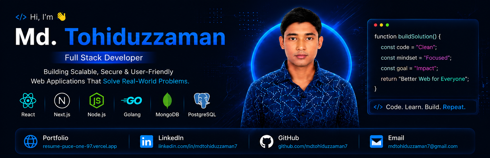

 

# 👋 Hi, I'm Md. Tohiduzzaman

### 🚀 Full Stack JavaScript Developer | React • Next.js • Node.js • Golang

[Portfolio](https://resume-puce-one-97.vercel.app/) •
[LinkedIn](https://www.linkedin.com/in/mdtohiduzzaman7/) •
[GitHub](https://github.com/mdtohiduzzaman7) •
[📧 Email Me](https://mail.google.com/mail/?view=cm&fs=1&to=mdtohiduzzaman7@gmail.com)

---

## 👨‍💻 About Me

I'm a passionate **Full Stack Developer** specializing in modern frontend and backend technologies.

I build scalable, responsive, and user-friendly web applications using **React, Next.js, Node.js, Golang, PostgreSQL, MongoDB, and Docker**.

- 🎯 **Goal:** Become a world-class Software Engineer
- 🌱 **Currently Learning:** System Design, Advanced Next.js, Golang Backend & Docker
- 💙 **Passion:** Building impactful products with clean architecture
- ⚡ **Approach:** Writing clean, maintainable, and scalable code
- 🚀 **Driven by:** Problem-solving and continuous improvement

📍 **Location:** Bangladesh
🌐 **Available For:** Remote | Onsite | Hybrid

---

## 💻 Technical Skills

### 📝 Languages

### 🎨 Frontend Development

### ⚙️ Backend Development

### 🗄️ Database & ORM

### 🛠️ Tools & Technologies

---

## 🌟 Featured Projects

### 📄 Resume Portfolio Website

A modern and fully responsive portfolio website built with Next.js.

**Tech Stack:** Next.js • TypeScript • Tailwind CSS • React Icons • Framer Motion • Docker

✅ Responsive Design ✅ Modern UI/UX ✅ Dark/Light Theme ✅ Smooth Animations ✅ SEO Optimized ✅ Fast Performance

🔗 **Live Demo:** https://resume-puce-one-97.vercel.app/
📂 **Source Code:** https://github.com/mdtohiduzzaman7/resume

### 🎟️ Football Ticket Booking System (Database Project)

A relational database design and query project for managing football match ticket bookings.

**Tech Stack:** SQL (DDL/DML) • ERD Design • PostgreSQL

✅ Complete ERD modeling for bookings, matches, venues, and users
✅ Normalized schema design
✅ Optimized queries for booking, availability, and reporting

### 🍷 LXV Wine & Spices — Landing Page (Freelance / Upwork)

Converted an AI-generated design into a clean, production-ready, deployable landing page for a client brand.

**Tech Stack:** HTML • CSS • JavaScript

✅ Pixel-accurate implementation from design mockup
✅ Fully responsive, cross-browser tested
✅ Delivered as a client-ready deployable build

---

## 📊 GitHub Analytics

---

## 🏆 Achievements

---

## 📈 Contribution Activity

---

## 💡 Currently Working On

🔥 Building Full Stack applications with Next.js & Golang
🐳 Containerizing applications using Docker
📚 Learning System Design, DSA & Algorithms
🚀 Improving Backend Architecture and API Development
🌱 Exploring new technologies

---

## 📖 Development Philosophy

> "Write code that the next person will love. Make it clean, maintainable, and meaningful."

✅ Clean & readable code
✅ Scalable architecture
✅ User-focused development
✅ Continuous learning
✅ Team collaboration

---

## 🤝 Connect With Me

| Platform | Link |
|---|---|
| 🌐 Portfolio | https://resume-puce-one-97.vercel.app |
| 🐙 GitHub | https://github.com/mdtohiduzzaman7 |
| 💼 LinkedIn | https://linkedin.com/in/mdtohiduzzaman7 |
| 📧 Email | [mdtohiduzzaman7@gmail.com](https://mail.google.com/mail/?view=cm&fs=1&to=mdtohiduzzaman7@gmail.com) |

---

### ⭐ If you like my work, consider starring my repositories!

### 🚀 Let's build something amazing together!

